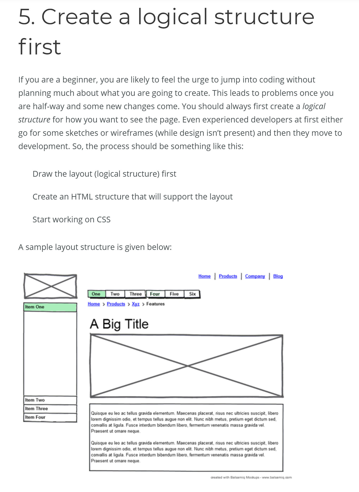

# Homework

## like about(reading and video)
#### Use proper document structure
  HTML documents will still work without elements such as <html>, <head>, and <body>. However, the pages will not render correctly in every browser so it's important to be consistent using the proper document structure.

#### Always close tags
To avoid encountering validation errors always remember to have a closing tag for every tag you create.

#### good CSS can only exist with equally good HTML markup.

#### Proper Indentation
All right, we are about three lines in and I’m already annoyed by the lack of indentation. Indentation has no bearing on how the page is rendered, but it has a huge effect on the readability of the code. Standard procedure is to indent one tab (or a few spaces) when you are starting a new element that is a child element of the tag above it. Then move back in a tab when you are closing that element.

### Naming things is hard. We’re trying to make things easier, and save ourselves time in the future with more maintainable code.

#### Use js- class names
One way to mitigate such bugs is to use a js-* class name to denote a relationship with the DOM element in question.

For example:

< div class="site-navigation js-site-navigation" >
< /div >

#### Gestalt Principles (the Law of Similarity)
Similarity can be achieved using basic elements such as shapes, colors, and size.

#### Proximity (also known as Emergence)
Simple shapes arranged together can create a more complex image.

## need help!
#### Validate frequently
Instead of waiting until you are finished with your HTML document, validate your code multiple times as you work. This will help save some time in the end by identifying errors early on, especially if your document is lengthy. One popular HTML validator to use is W3C's markup validation service.

#### Don't use inline styles
It may seem like an easy route to place styling in line with the code instead of creating an external style sheet. However, inline styles are not a good coding practice because it makes it harder to update and maintain a website. Instead, keep your styles separate from your HTML mark-up.

##### B=block(this ‘block’ could represent a site navigation, header, footer, or any other block of design.)
##### E=elements(The head , feet, and arms are all elements within the component.)
##### M=Modifiers(this could be a red button or blue button. These are modifications of the component in question.

